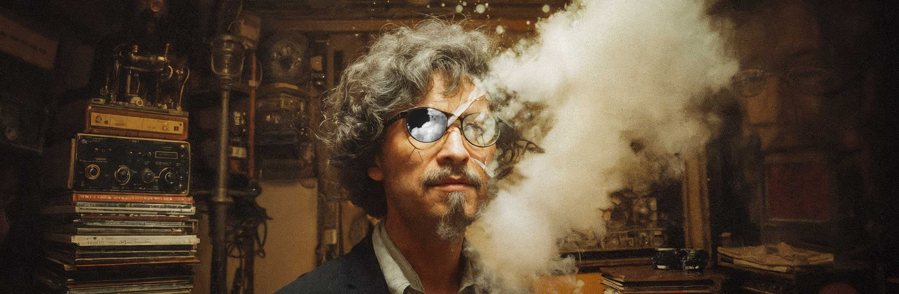

# 🎵 GrooveShelf

GrooveShelf is a simple React application for music lovers to **create a personal collection of favorite albums**, organized by genre, just like your own digital record shelf.



---

## 📌 **Features**

✅ Add albums with:
- Album Name  
- Artist Name  
- Album Cover (URL)  
- Genre (Rock, Pop, Jazz, Indie, Electronic)

✅ Form toggle with an icon button  
✅ Spotify-inspired dark theme & accent colors  
✅ Smooth pulsing banner, genre colors & modern card style  
✅ Responsive, clean layout for portfolio showcase

---

## 🚀 **Live Site**

Hosted on [Vercel](https://vercel.com/) — deploy in seconds and get a free `.vercel.app` URL.

---

## ⚙️ **How to run locally**

```bash
# Install dependencies
npm install

# Start local server
npm start
